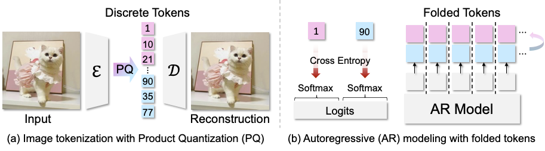
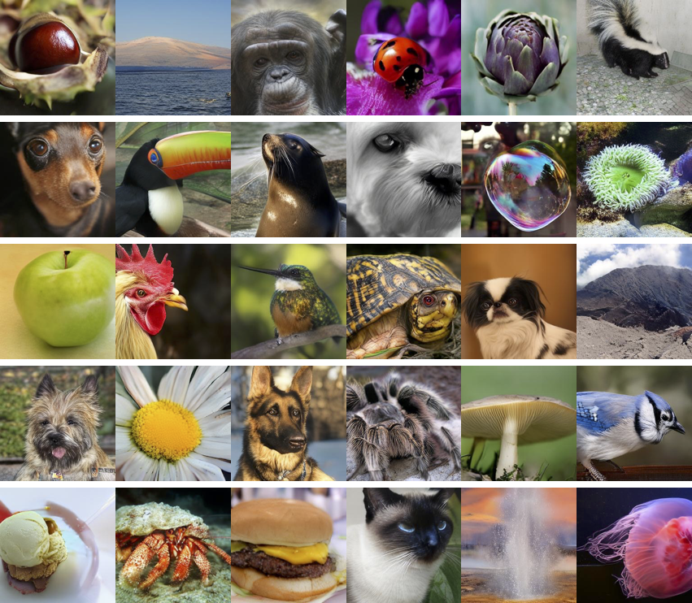
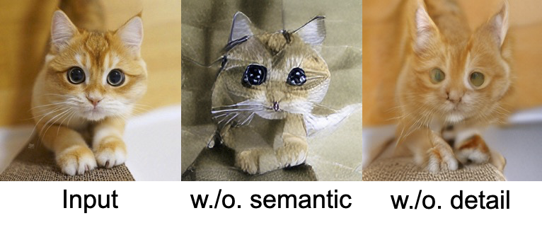

# ImageFolder🚀: Autoregressive Image Generation with Folded Tokens

<div align="center">

[](https://lxa9867.github.io/works/imagefolder/index.html)&nbsp;
[](placeholder)&nbsp;
[](placeholder)&nbsp;

</div>
<!-- <p align="center" style="font-size: larger;">
  <a href="placeholder">🔥ImageFolder: Autoregressive Image Generation with Folded Tokens</a>
</p> -->

<p align="center">

<p align="center">


<p>


# Updates 
- (2024.10.01) Repo created. Code and checkpoints will be released soon.

# Generation



# Visualization of Decomposed Token



# Citation
if our work assists your research, feel free to give us a star ⭐ or cite us using
```
@article{ImageFolder2024,
  author = {Xiang Li and Hao Chen and Kai Qiu and Jason Kuen and Jiuxiang Gu and Bhiksha Raj and Zhe Lin},
  title = {ImageFolder: Autoregressive Image Generation with Folded Tokens},
  journal = {Arxiv},
  year = {2024},
}
```
