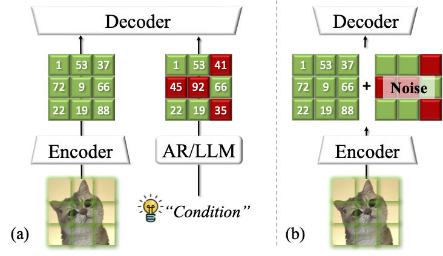
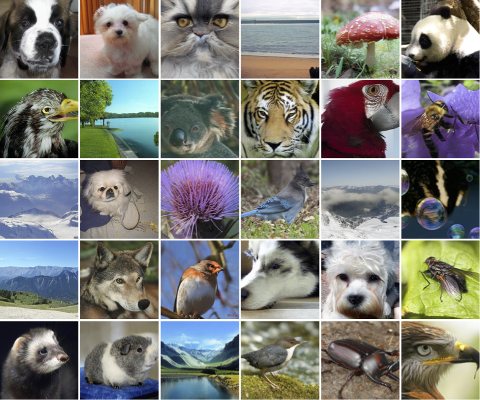

# Robust Latent Matters: Boosting Image Generation with Sampling Error Synthesis

<div align="center">

[](https://arxiv.org/pdf/2503.08354)&nbsp;
[]()&nbsp;

</div>

<p>

</p>

## Model Zoo
| Model | Link | FID |
| ------------- | ------------- | ------------- |
| RAR-B | [checkpoint](https://huggingface.co/qiuk6/RobustTok/resolve/main/rar-b.bin?download=true)| 1.83 (generation) |
| RAR-L | [checkpoint](https://huggingface.co/qiuk6/RobustTok/resolve/main/rar-l.bin?download=true)| 1.60 (generation) |

## Inference Code
```python
# Reproducing RAR-B
torchrun --nnodes=1 --nproc_per_node=8 --rdzv-endpoint=localhost:9999 sample_imagenet_rar.py config=configs/training/generator/rar.yaml \
    experiment.output_dir="rar_b" \
    experiment.generator_checkpoint="rar_b.bin" \
    mode.vq_ckpt=/path/to/RobustTok.pt \
    model.generator.hidden_size=768 \
    model.generator.num_hidden_layers=24 \
    model.generator.num_attention_heads=16 \
    model.generator.intermediate_size=3072 \
    model.generator.randomize_temperature=1.02 \
    model.generator.guidance_scale=6.0 \
    model.generator.guidance_scale_pow=1.15
# Run eval script. The result FID should be ~1.83
python3 evaluator.py VIRTUAL_imagenet256_labeled.npz rar_b.npz

# Reproducing RAR-L
torchrun --nnodes=1 --nproc_per_node=8 --rdzv-endpoint=localhost:9999 sample_imagenet_rar.py config=configs/training/generator/rar.yaml \
    experiment.output_dir="rar_l" \
    experiment.generator_checkpoint="rar_l.bin" \
    mode.vq_ckpt=/path/to/RobustTok.pt \
    model.generator.hidden_size=1024 \
    model.generator.num_hidden_layers=24 \
    model.generator.num_attention_heads=16 \
    model.generator.intermediate_size=4096 \
    model.generator.randomize_temperature=1.04 \
    model.generator.guidance_scale=6.75 \
    model.generator.guidance_scale_pow=1.01
# Run eval script. The result FID should be ~1.60
python3 evaluator.py VIRTUAL_imagenet256_labeled.npz rar_l.npz

```
## Training Preparation
We follow [RAR](https://github.com/bytedance/1d-tokenizer) to pretokenize the whole dataset for speed-up the training process. We have uploaded [it](https://huggingface.co/qiuk6/RobustTok/resolve/main/RobustTok-zero-pretokenized.jsonl?download=true) so you can train RobustTok-RAR directly.

## Training Code
```
accelerate launch scripts/train_rar.py experiment.project="rar" experiment.name="rar_b" experiment.output_dir="rar_b" model.generator.hidden_size=768 model.generator.num_hidden_layers=24 model.generator.num_attention_heads=16 model.generator.intermediate_size=3072 config=configs/generator/robustTok-rar.yaml dataset.params.pretokenization=/path/to/pretokenized.jsonl mode.vq_ckpt=/path/to/RobustTok.pt

accelerate launch scripts/train_rar.py experiment.project="rar" experiment.name="rar_l" experiment.output_dir="rar_l" model.generator.hidden_size=1024 model.generator.num_hidden_layers=24 model.generator.num_attention_heads=16 model.generator.intermediate_size=4096 config=configs/generator/robustTok-rar.yaml dataset.params.pretokenization=/path/to/pretokenized.jsonl mode.vq_ckpt=/path/to/RobustTok.pt
```

## Visualization Result

<p>

</p>

## Acknowledge
[RAR](https://github.com/bytedance/1d-tokenizer)